# NETStart Aptitude Test Integration Plan

**Document Version:** 1.1.0  
**Date:** September 30, 2026  
**Status:** Updated per User Review / Pending Final Approval  

---

## 1. Executive Summary

This specification outlines the integration of the 15-question diagnostic aptitude assessment into **NETStart**. The questions are sourced from `Staging/aptitude_questions.json`.

### Key Objectives, Security & Sequence Constraints
1. **Server-Side Answer Key Isolation:** The client receives questions **without** `answer`, `explanation`, or `reference` attributes. The answer key is never sent to the browser or bundled in client-side code.
2. **Local Algorithmic Grading:** A Next.js API route handler receives `{ questionId: chosenOption }` for all 15 questions, validates inputs, and grades answers locally on the server without third-party AI latency or cost.
3. **Strict Order: Grade & Save to Database FIRST:** When a student submits their test, the server grades the answers and **immediately commits the result to the database** (updating user scores, setting `hasTakenAptitudeTest = true`, and awarding XP/Gears).
4. **Post-Grading Gemini Context:** Only **after** the result is safely graded and persisted in the database, the server passes the compact summary object (scores, category ratings, and missed concepts—strictly excluding answer keys and full question text) to the Gemini API layer as context for AI diagnostics and recommendations. Even if the Gemini call is slow or fails, the user's saved test grade and progress remain 100% intact.
5. **Seamless Flow Continuity:** The result integrates directly into the established sequence (`BRIEFING` → `QUIZ` → `COMPLETED` → `CUTSCENE`), enabling unlocked planetary sectors in `/modules`.
6. **Existing Project Theme Compliance:** The interface strictly adheres to NETStart's existing design system and theme (deep purple `#130927`/`#180729`, electric amber `#ff912d`, custom typography, cyber cards, and glassmorphic telemetry), rather than the document/table formatting from `Apt Test.html`.

---

## 2. File Architecture & Impact Analysis

| File Path | Type | Responsibility |
| :--- | :--- | :--- |
| `frontend-next/src/server/data/aptitude_questions.server.json` | **New** | Server-only master question bank containing all 15 questions with answers, explanations, options, and referenced concepts. Stored outside client bundles. |
| `frontend-next/src/types/aptitude.ts` | **New** | TypeScript interface definitions for sanitized questions, submission payloads, category calculations, missed concept items, and AI telemetry context. |
| `frontend-next/src/app/api/aptitude/questions/route.ts` | **New** | `GET` route handler that strips `answer`, `explanation`, and `reference` before serving questions to the frontend. |
| `frontend-next/src/app/api/aptitude/grade/route.ts` | **New** | `POST` route handler that validates the submission of all 15 questions, grades locally against the server answer key, **saves to the database first**, then passes the compact summary to Gemini, and returns the result. |
| `frontend-next/src/lib/gemini.ts` | **New** | Gemini service layer that accepts the compact result object, queries Google Generative AI for customized diagnostic analysis and learning recommendations, and handles offline/missing-key fallbacks gracefully. |
| `frontend-next/prisma/schema.prisma` | **Modified** | Extends the `User` model with `aptitudeResult Json?` and `taskDecompositionScore Int?` to preserve the complete 3-category profile alongside `logicScore` and `patternRecognitionScore`. |
| `frontend-next/src/app/aptitude-test/AptitudeTestClient.tsx` | **Modified** | Overhauls the quiz runner to display all 15 questions across 3 categories (Pattern Recognition, Task Decomposition, Logical Reasoning), submits via `POST /api/aptitude/grade`, and renders the detailed report card in the `COMPLETED` state. Complies with the custom modal/toast UI rule and existing project styling. |
| `frontend-next/src/app/aptitude-test/page.tsx` | **Modified** | Updates the server-side user query to load `aptitudeResult` and `taskDecompositionScore` so returning users immediately see their past diagnostic results. |
| `frontend-next/src/app/modules/ModulesClient.tsx` | **Modified** | Uses the verified aptitude completion state to lift diagnostic gating modals, trigger the 3-second cinematic dark reveal, and highlight recommended starting sectors. |
| `frontend-next/src/lib/auth.ts` | **Modified** | Ensures NextAuth JWT and session token synchronization reflect `hasTakenAptitudeTest` updates immediately without re-login. |

---

## 3. End-to-End Data Flow

```mermaid
sequenceDiagram
    autonumber
    actor User as Student
    participant Client as AptitudeTestClient
    participant ServerQ as GET /api/aptitude/questions
    participant ServerG as POST /api/aptitude/grade
    participant DB as Postgres (Prisma)
    participant Gemini as Gemini AI Layer
    participant Modules as ModulesClient (Planets)

    User->>Client: Opens /aptitude-test (State: BRIEFING)
    Client->>ServerQ: Request questions
    ServerQ-->>Client: Returns 15 sanitized questions (NO answers, NO explanations, NO references)
    User->>Client: Clicks "Start Assessment" (State: QUIZ)
    User->>Client: Answers all 15 questions (A, B, C, D)
    User->>Client: Clicks "Submit Diagnostic"
    Client->>ServerG: POST { answers: { "pr-1": "B", ..., "lr-5": "B" } }
    
    rect rgb(30, 15, 50)
        note over ServerG: 1. Local Algorithmic Grading (NO Gemini)<br/>Validate all 15 question IDs<br/>Grade against server master key<br/>Compute category scores & missed concepts
    end

    rect rgb(15, 45, 30)
        note over ServerG,DB: 2. PERSIST FIRST TO DATABASE<br/>Commit user scores, set hasTakenAptitudeTest=true<br/>Award XP (+150) & Gears (+50)<br/>Write system log & in-app notification
        ServerG->>DB: Update User & Create Notifications / System Logs
        DB-->>ServerG: Confirmed Committed to Database
    end

    rect rgb(20, 35, 55)
        note over ServerG,Gemini: 3. Post-Grading AI Context Handoff<br/>(Executed only after DB save succeeds)<br/>Pass compact result (scores, strongest/weakest, missed concepts only)
        ServerG->>Gemini: Pass compact result context
        Gemini-->>ServerG: Returns tailored diagnostic commentary & orbit advice (or graceful fallback)
    end
    
    ServerG-->>Client: Returns AptitudeTestResult + AI diagnostic summary
    Client->>User: State: COMPLETED (Displays 3-category report, missed concepts, AI feedback)
    User->>Client: Clicks "Start Journey" (State: CUTSCENE)
    Client->>Modules: Cutscene finishes -> router.push('/modules?fromCutscene=true')
    Modules->>User: Diagnostic gate lifted, 3s black overlay reveals unlocked planetary map
```



### Detailed Flow Phases

1. **Question Delivery (`GET /api/aptitude/questions`)**:
   - The server reads `aptitude_questions.server.json`.
   - Projects each item into a safe client payload: `{ id, category, number, title, question, options }`.
   - Strips `answer`, `explanation`, and `reference`.
2. **Assessment Execution (`AptitudeTestClient.tsx`)**:
   - Initial state: `BRIEFING` (custom modal overview styled with the existing project theme).
   - Quiz state: `QUIZ` (segmented progress bar across the 3 categories: 5 Pattern Recognition, 5 Task Decomposition, 5 Logical Reasoning).
   - Answer map collected in component state: `{ [questionId]: "A" | "B" | "C" | "D" }`.
3. **Local Server Grading (`POST /api/aptitude/grade`)**:
   - Checks session authentication (`getServerSession(authOptions)`).
   - Validates that all 15 questions have an answer among `"A"`, `"B"`, `"C"`, or `"D"`.
   - Iterates through the questions, compares against `q.answer`, and computes:
     - Total score and percentage (`totalCorrect / 15 * 100`).
     - Category scores (Pattern Recognition, Task Decomposition, Logical Reasoning).
     - Strongest and weakest category.
     - `missed` list: `[{ id, chosenOption, concept }]` using `q.reference.concept` (with standardized fallbacks for original questions `td-3` and `td-5`).
4. **Database Persistence FIRST**:
   - In a Prisma database transaction, the server commits:
     - `User` record updated with `hasTakenAptitudeTest = true`, `aptitudeResult` JSON, `logicScore`, `patternRecognitionScore`, `taskDecompositionScore`, `recommendedLearningPath`.
     - Gamification rewards credited (+150 XP, +50 Gears).
     - `APTITUDE_TEST_COMPLETED` logged in `system_logs`.
     - `aptitude_completed` in-app notification created.
5. **AI Context Handoff (AFTER DB Save)**:
   - Formulates the compact context payload (scores, strongest, weakest, missed concepts).
   - Sends payload to the Gemini API layer (`src/lib/gemini.ts`).
   - Gemini returns tailored diagnostic analysis and orbit advice.
   - If Gemini is unreachable or takes too long, a fast rule-based fallback advice object is used so the client response is never held up or failed.
6. **Progression to Modules**:
   - State flips to `COMPLETED` displaying the telemetry report using existing NETStart UI components.
   - User clicks "Start Journey" → triggers `CUTSCENE` (`VisualNovelCutscene`).
   - Cutscene completes → routes to `/modules?fromCutscene=true`.
   - `ModulesClient` detects `hasTakenAptitudeTest: true` and reveals the planetary map.

---

## 4. Result Schemas

### A. Graded Result Stored in Database & Sent to Client (`AptitudeTestResult`)

```typescript
export interface CategoryScore {
  category: "pattern_recognition" | "task_decomposition" | "logical_reasoning";
  name: string;             // "Pattern Recognition" | "Task Decomposition" | "Logical Reasoning"
  correct: number;          // e.g. 4
  total: number;            // 5
  percent: number;          // e.g. 80
}

export interface MissedQuestionItem {
  id: string;               // e.g. "td-2"
  chosenOption: string;     // e.g. "A"
  concept: string;          // e.g. "Bubble sort algorithm"
}

export interface CategorySummary {
  category: "pattern_recognition" | "task_decomposition" | "logical_reasoning";
  name: string;
  percent: number;
}

export interface AptitudeTestResult {
  totalCorrect: number;     // e.g. 12
  totalQuestions: number;   // 15
  totalPercent: number;     // e.g. 80
  categories: {
    pattern_recognition: CategoryScore;
    task_decomposition: CategoryScore;
    logical_reasoning: CategoryScore;
  };
  strongestCategory: CategorySummary;
  weakestCategory: CategorySummary;
  missed: MissedQuestionItem[];
  recommendedLearningPath: string;
  aiInsight?: {
    summary: string;
    advice: string;
  };
  completedAt: string;      // ISO 8601 string
}
```

### B. Compact Object Passed to Gemini API Layer (`AptitudeAIContext`)

> [!IMPORTANT]
> The Gemini API layer is strictly forbidden from receiving the answer key, question text, or raw options. It receives only this compact telemetry object.

```typescript
export interface AptitudeAIContext {
  totalScore: string;           // e.g. "12/15 (80%)"
  categories: {
    patternRecognition: string; // e.g. "5/5 (100%)"
    taskDecomposition: string;  // e.g. "3/5 (60%)"
    logicalReasoning: string;   // e.g. "4/5 (80%)"
  };
  strongestCategory: string;    // e.g. "Pattern Recognition (100%)"
  weakestCategory: string;      // e.g. "Task Decomposition (60%)"
  missedConcepts: string[];     // e.g. ["Bubble sort algorithm", "Iteration and Looping (System Cycle)"]
}
```

---

## 5. Storage Architecture & Persistence

1. **User Profile Table (`users`)**:
   - `aptitude_result` (`Json?`): Stores the complete `AptitudeTestResult` object for full historical fidelity.
   - `pattern_recognition_score` (`Int?`): Scaled 0–100 percentage.
   - `task_decomposition_score` (`Int?`): Scaled 0–100 percentage.
   - `logic_score` (`Int?`): Scaled 0–100 percentage.
   - `has_taken_aptitude_test` (`Boolean`): Updated to `true`.
   - `recommended_learning_path` (`String?`): Direct text label for fast UI access across pages.
2. **Audit / Activity Log (`system_logs`)**:
   - Event: `APTITUDE_TEST_COMPLETED`
   - Actor: `userId`
   - Details: Compact JSON with score summary and timestamp.
3. **In-App Notification (`notifications`)**:
   - Type: `aptitude_completed`
   - Content: Summary scores and notice that orbital learning path is unlocked.
4. **Client Session (`NextAuth`)**:
   - `hasTakenAptitudeTest` synced to session token via `update()` callback so gatekeeper modals update immediately without requiring manual re-login.

---

## 6. UI & Design System Compliance

- **NETStart Project Theme Only**: All question cards, progress indicators, option buttons, and report sections strictly use the existing NETStart color palette (`bg-[#130927]`, `bg-[#1e0a2d]`, accents in `#ff912d`, `font-display`, `font-mono`). Document/table styling from `Apt Test.html` is completely discarded.
- **Custom Modals & Toasts Rule**: No browser native `alert()`, `confirm()`, or `prompt()` calls. Confirmation modals, unanswered question warnings, and submission errors are displayed through custom UI modals and glassmorphic toast notifications.
